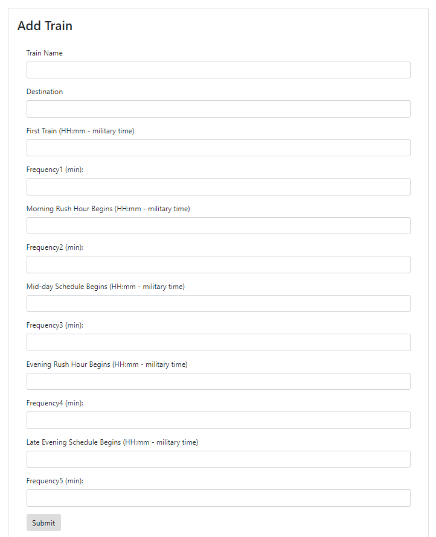

# TrainScheduler

**Goal**

* This app allows the user to find the next train at Chicago CTA Randolph/Wabash station. Four buttons allow access to the CTA website.

* There are four different lines that stop at Randolph/Wabash station: Pink, Green, Brown and Orange. 

You can see the real schedules here:

**Accessing the Service**

You can find the service on
[GitHub](https://edudek002.github.io/TrainScheduler/)

**User Flow**

1. Current Train Schedule

* The user can view the live schedule for 4 different lines.

* The lines have a different frequency depending on the time of the day.

 2. Add a Train

 * The lines have a different frequency depending on the time of the day, thus the user can enter 5 different segments: early morning, morning rush hour, mid-day, evening rush hour and late evening.

 

 